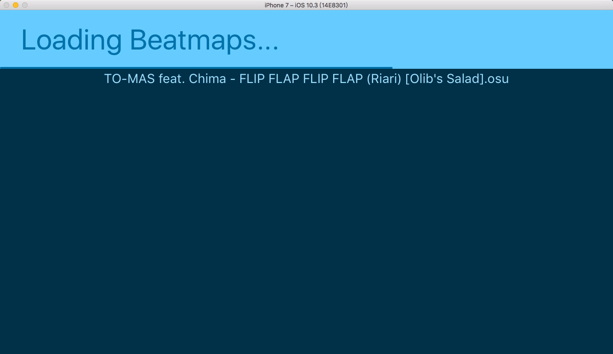
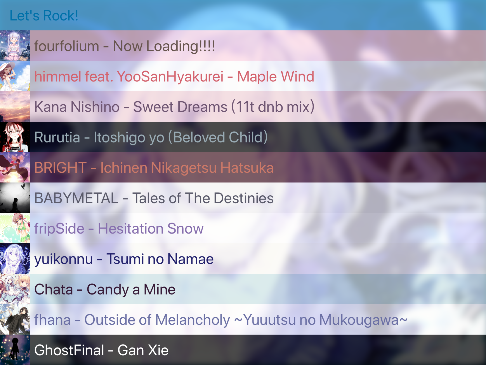
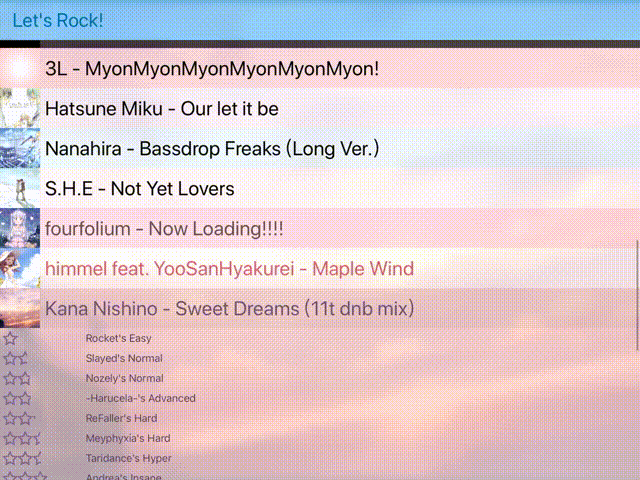

## UI implementation for [iosu](https://github.com/imxieyi/iosu)
This is the UI implementation for iosu. The sketch file can be found [here](https://github.com/imxieyi/iosu/blob/master/assets/ui_design.sketch).

## Screenshot

## Credit
 - [SQLite.swift](https://github.com/stephencelis/SQLite.swift)
 - [AsyncSwift](https://github.com/AndrewBarba/AsyncSwift)
 - [UIImageColors](https://github.com/jathu/UIImageColors)
 - [BCColor](https://github.com/boycechang/BCColor)
 - [UIColor_Hex_Swift](https://github.com/yeahdongcn/UIColor-Hex-Swift)
 - [AiModtpDifficultyCalculator](https://github.com/Tom94/AiModtpDifficultyCalculator)
 - [VectorMath](https://github.com/nicklockwood/VectorMath)
 - [UIBezierPath-Length](https://github.com/ImJCabus/UIBezierPath-Length)
 - [Pixiv_よっちゃん](https://www.pixiv.net/member_illust.php?mode=medium&illust_id=63797333）
